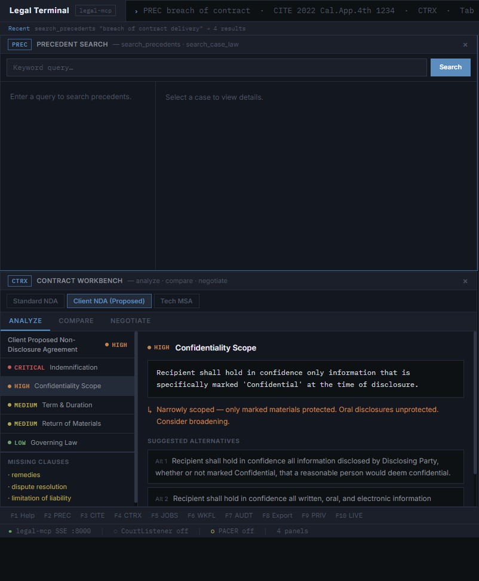
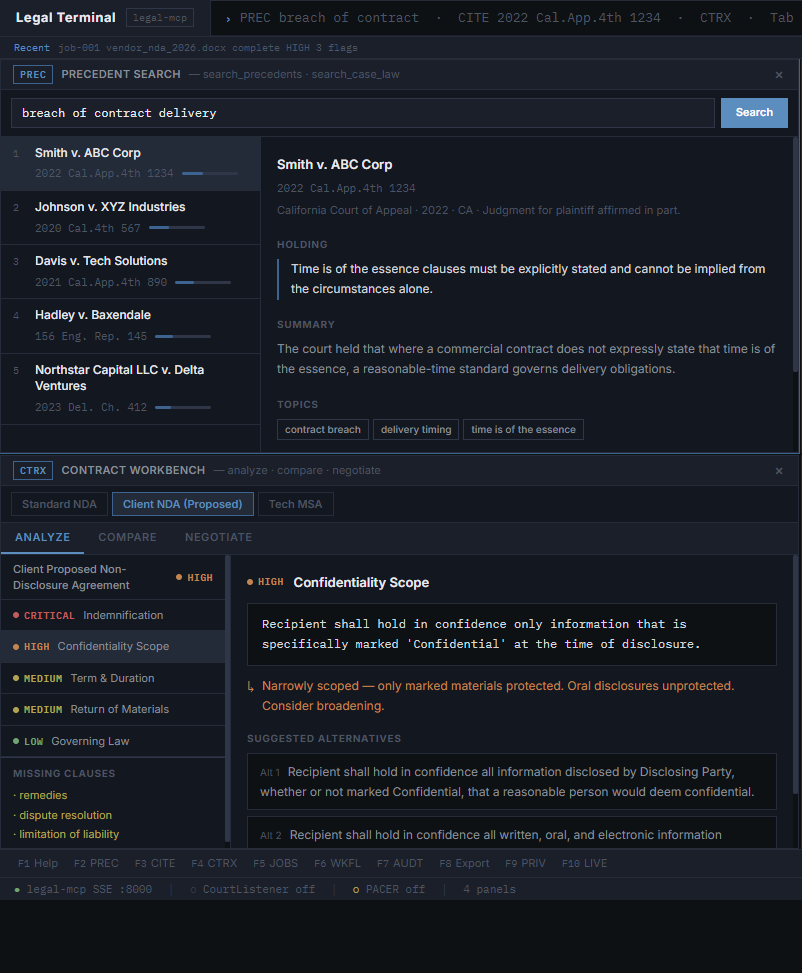
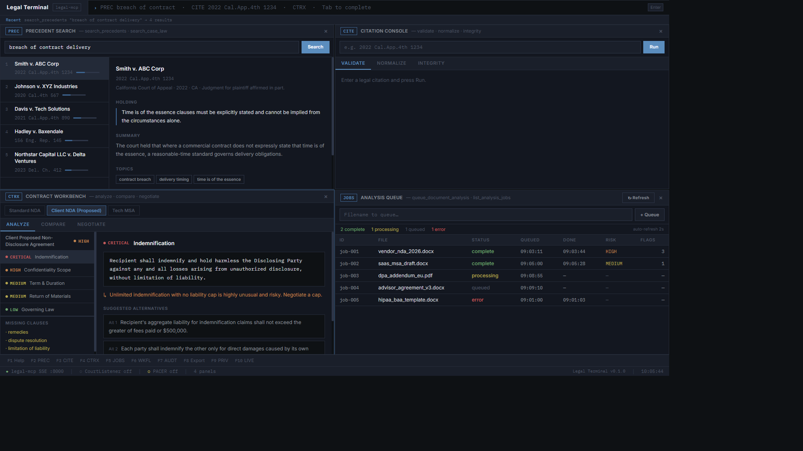
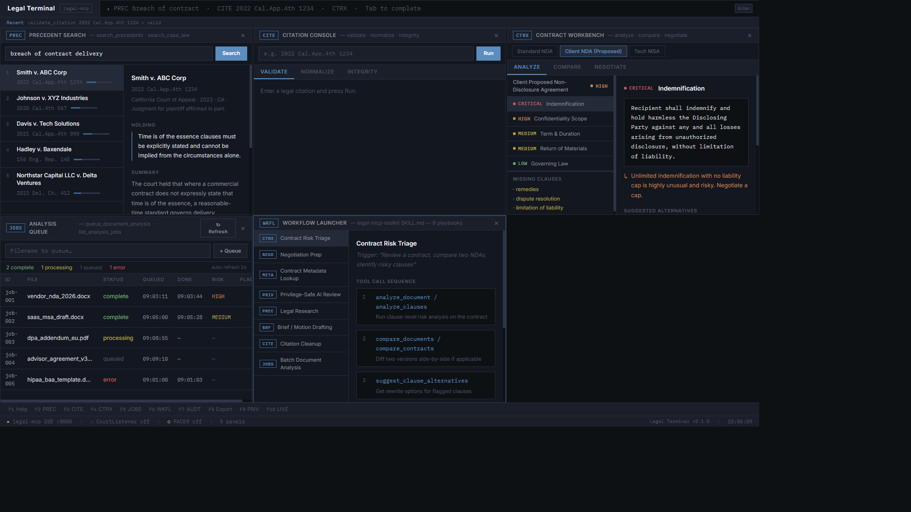
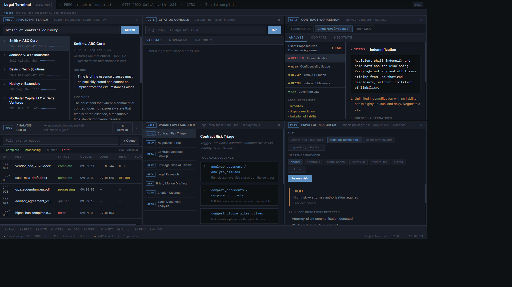
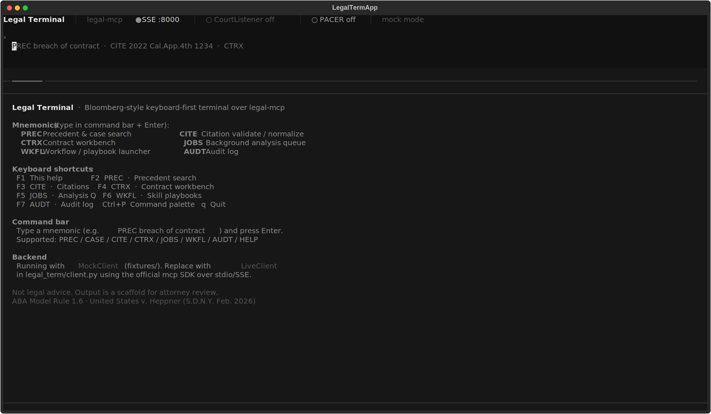
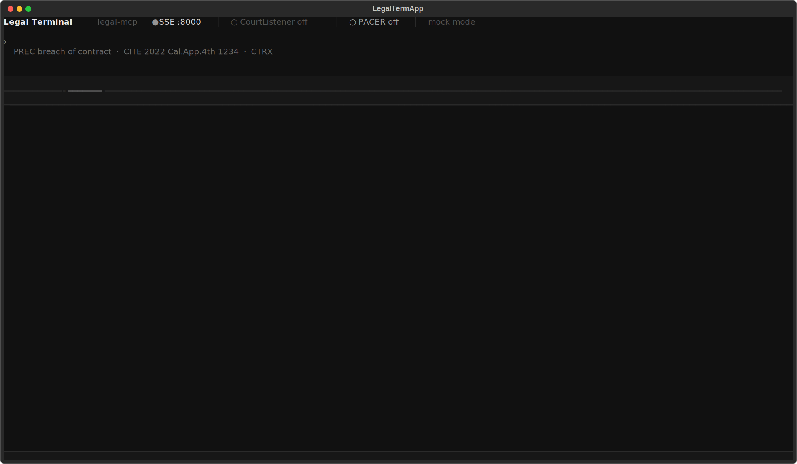
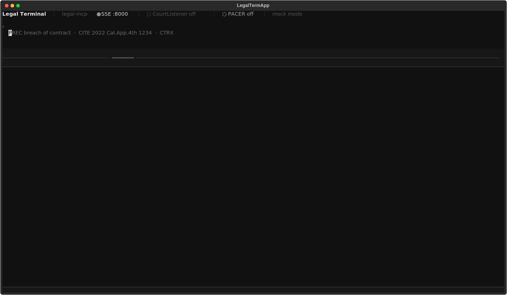
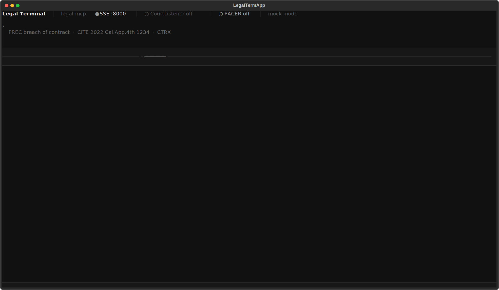

# Legal Terminal

> A Bloomberg-style keyboard-first terminal for legal practice, built on top of [legal-mcp](https://github.com/agentic-ops/legal-mcp).
> Two front-ends — a React web terminal and a Python TUI — both powered by the same mocked MCP client.

---

**Showcase repository** · All rights reserved · See [LICENSE](./LICENSE)

---

## Screenshots

### Web Terminal

| Workspace | Precedent Search |
|-----------|-----------------|
|  |  |

| Contract Workbench — Critical Clause | Workflow Launcher |
|--------------------------------------|------------------|
|  |  |

| Privilege Risk Check |
|----------------------|
|  |

---

### TUI (Terminal UI)

| Help / Home | Precedent Search |
|-------------|-----------------|
|  |  |

| Contract Workbench | Analysis Queue |
|--------------------|----------------|
|  |  |

---

## What is this?

Legal Terminal is a keyboard-first, multi-panel terminal interface for legal work,
inspired by Bloomberg Terminal's density and workflow philosophy. It wraps the
[legal-mcp](https://github.com/agentic-ops/legal-mcp) Model Context Protocol server
in a professional-grade UI — both a browser-based web terminal and a native Python TUI.

**Current state:** MVP with fully mocked backend. All interactions work; the MCP
server is not live-wired. Drop in a `LiveClient` to connect to the real server.

---

## Panels & Mnemonics

| Key | Panel | MCP Tool(s) |
|-----|-------|-------------|
| `PREC` | Precedent & Case Search | `search_precedents`, `search_case_law` |
| `STAT` | Statute Viewer | `extract_statute` |
| `CITE` | Citation Console | `validate_citation`, `normalize_citation`, `verify_citation_integrity` |
| `CTRX` | Contract Workbench | `analyze_clauses`, `suggest_clause_alternatives`, `generate_negotiation_guide`, `compare_contracts` |
| `DOCA` | Document Analyzer | `analyze_document`, `extract_contract_metadata` |
| `PRIV` | Privilege Risk Check | `check_privilege_risk` (Heppner / ABA Rule 1.6) |
| `BRF`  | Brief Builder | `generate_brief_outline`, `create_argument_structure`, `generate_issue_statement` |
| `JOBS` | Analysis Queue | `queue_document_analysis`, `list_analysis_jobs`, `get_analysis_status` |
| `WKFL` | Workflow Launcher | `legal-mcp-toolkit` SKILL.md playbooks |
| `AUDT` | Audit Log | `utils.audit` — all tool invocations |
| `LIVE` | Integration Status | `integration_status` — CourtListener, PACER |

---

## Architecture

```
legal-terminal/
├── webterm/              React + TypeScript + Vite + Tailwind
│   └── src/
│       ├── mcp/          LegalMcpClient interface + MockClient
│       ├── store/        Zustand state (panels, history)
│       ├── components/   Shell chrome (header, command bar, status bar)
│       └── panels/       11 panel components (PREC, STAT, CITE, …)
├── tui/                  Python + Textual + Rich
│   └── legal_term/
│       ├── client.py     LegalMcpClient protocol + MockClient
│       ├── app.py        LegalTermApp — tabs, command bar, key bindings
│       ├── widgets/      6 embedded tab widgets (PREC, CITE, CTRX, JOBS, WKFL, AUDT)
│       └── theme.tcss    Graphite/slate Textual CSS
├── fixtures/             Shared mock JSON (cases, statutes, contracts, jobs, audit, workflows)
├── docs/screenshots/     Web PNGs + TUI SVGs
└── LICENSE               Proprietary — viewing only, contact for permission
```

---

## Quick Start

### Web terminal

```bash
cd webterm
npm install
npm run dev          # http://localhost:5173
```

Keyboard shortcuts: `F2`–`F10` open panels. Type mnemonics in the command bar (e.g. `PREC breach of contract`, `CITE 2022 Cal.App.4th 1234`).

### TUI

```bash
cd tui
pip install -e .
legal-term
```

Or `python -m legal_term`. Same mnemonics in the command bar; `F1`–`F7` for tabs.

---

## Backend wiring plan

Replace `MockClient` in:
- `webterm/src/mcp/mockClient.ts` → a `LiveClient` using the MCP TypeScript SDK over SSE (`http://localhost:8000/sse`)
- `tui/legal_term/client.py` → a `LiveClient` using the `mcp` Python SDK over stdio or SSE

The `legal-mcp` server exposes the same tool names used throughout this codebase.
Clone and run it separately: [agentic-ops/legal-mcp](https://github.com/agentic-ops/legal-mcp)

> **Note:** `legal-mcp` is licensed under AGPL-3.0 and is not included in this repository.

---

## License

Copyright © 2026 Edwin Genego / agentic-ops. All rights reserved.

This is a showcase repository. Viewing is permitted for personal evaluation.
Any use, copying, modification, or distribution requires prior written permission.
See [LICENSE](./LICENSE) for full terms. Contact: edwin@genego.io
